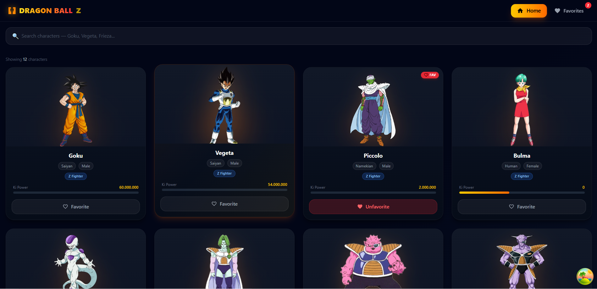
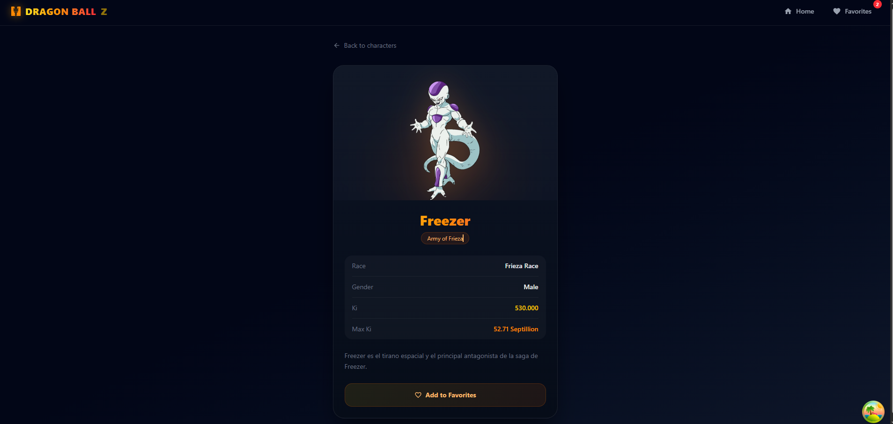
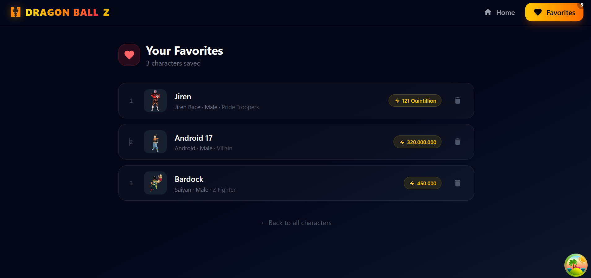

# 🐉 Dragon Ball Characters App

A modern React application that displays Dragon Ball characters using infinite scrolling, search, and favorites functionality.

---

## 🚀 Features

* 🔍 Search characters (Goku, Vegeta, Frieza...)
* ♾️ Infinite scrolling (React Query)
* ❤️ Add/Remove favorites (localStorage)
* 📄 Character detail page
* ⚡ Optimistic UI updates
* 🌙 Dark modern UI (Tailwind CSS)

---

## 🛠️ Tech Stack

* React JS
* React Router DOM
* TanStack React Query
* Axios
* Tailwind CSS
* LocalStorage (Favorites)

---

## 📦 Installation

```bash
npm install
npm run dev
```

---

## 📡 API Used

https://dragonball-api.com/

---

## 🧠 Key Concepts Used

* useInfiniteQuery (pagination)
* Intersection Observer (infinite scroll)
* Optimistic updates (favorites)
* Context API (search state)

---

## 🐞 Common Issues

### ❌ Showing 0 characters

✔ Ensure:

* `useInfiniteQuery` is used (NOT useQuery)
* `QueryClientProvider` is added
* API response mapped correctly (`items → characters`)

---

## 📸 Screenshots





---

## 👨‍💻 Author

Nasim Reja Mondal

---

## ⭐ Support

If you like this project, give it a ⭐ on GitHub!
